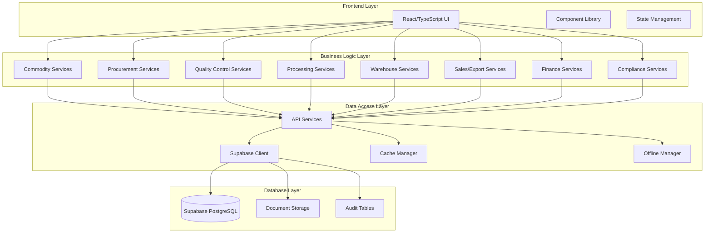

# Design Document

## Overview

This design document outlines the transformation of the existing LPG/petroleum management system into a comprehensive Commodity Processing & Export ERP System. The transformation will maintain the existing React/TypeScript frontend architecture while completely restructuring the data models, business logic, and workflows to support agro-commodity trading operations.

The system will be built as a single-tenant application initially, with architectural considerations for future multi-tenant SaaS conversion. The design prioritizes financial integrity through double-entry accounting, batch-level traceability, export compliance, and comprehensive audit trails.

## Architecture

### High-Level Architecture



### Technology Stack

- **Frontend**: React 19.2.3, TypeScript, Vite
- **Backend**: Supabase (PostgreSQL, Authentication, Storage)
- **State Management**: React Context API
- **UI Components**: Custom components with Lucide React icons
- **Reporting**: jsPDF, Recharts
- **Data Processing**: XLSX for Excel import/export
- **Caching**: Custom cache manager with offline support

## Components and Interfaces

### Core Data Models Transformation

#### From Petroleum to Commodity Models

**Current Petroleum Models (to be replaced):**
```typescript
enum ProductType {
  PMS = 'PMS (Petrol)',
  AGO = 'AGO (Diesel)', 
  DPK = 'DPK (Kerosene)',
  LPG = 'LPG (Gas)'
}
```

**New Commodity Models:**
```typescript
interface CommodityCategory {
  id: string;
  name: string;
  description?: string;
  isActive: boolean;
  createdAt: string;
}

interface CommodityType {
  id: string;
  categoryId: string;
  name: string;
  hsCode: string;
  exportEligible: boolean;
  qualityParameters: QualityParameter[];
  packagingTypes: PackagingType[];
  isActive: boolean;
}

interface QualityParameter {
  id: string;
  name: string;
  unit: string;
  minValue?: number;
  maxValue?: number;
  isRequired: boolean;
}

interface CommodityBatch {
  id: string;
  batchNumber: string;
  commodityTypeId: string;
  supplierId: string;
  warehouseId: string;
  cropYear: string;
  receivedDate: string;
  receivedWeight: number;
  currentWeight: number;
  qualityTests: QualityTest[];
  grade: string;
  status: 'RECEIVED' | 'TESTED' | 'APPROVED' | 'REJECTED' | 'PROCESSED' | 'SHIPPED';
}
```

### Module Architecture

#### 1. Commodity Master Module
```typescript
interface CommodityMasterService {
  // Category Management
  createCategory(category: CommodityCategory): Promise<CommodityCategory>;
  updateCategory(id: string, updates: Partial<CommodityCategory>): Promise<CommodityCategory>;
  getCategories(): Promise<CommodityCategory[]>;
  
  // Commodity Type Management
  createCommodityType(type: CommodityType): Promise<CommodityType>;
  updateCommodityType(id: string, updates: Partial<CommodityType>): Promise<CommodityType>;
  getCommodityTypes(categoryId?: string): Promise<CommodityType[]>;
  
  // Quality Parameters
  defineQualityParameters(commodityTypeId: string, parameters: QualityParameter[]): Promise<void>;
}
```

#### 2. Procurement Module
```typescript
interface ProcurementService {
  // Supplier Management
  createSupplier(supplier: Supplier): Promise<Supplier>;
  updateSupplier(id: string, updates: Partial<Supplier>): Promise<Supplier>;
  getSuppliers(): Promise<Supplier[]>;
  getSupplierPerformance(supplierId: string): Promise<SupplierPerformance>;
  
  // Purchase Contracts
  createPurchaseContract(contract: PurchaseContract): Promise<PurchaseContract>;
  updateContract(id: string, updates: Partial<PurchaseContract>): Promise<PurchaseContract>;
  trackContractDeliveries(contractId: string): Promise<ContractDelivery[]>;
  
  // Goods Receipt
  recordGoodsReceipt(receipt: GoodsReceipt): Promise<CommodityBatch>;
  generateBatchNumber(commodityTypeId: string, receivedDate: string): string;
}
```

#### 3. Quality Control Module
```typescript
interface QualityControlService {
  // Quality Testing
  recordQualityTest(batchId: string, test: QualityTest): Promise<QualityTest>;
  calculateGrade(batchId: string): Promise<string>;
  approveQuality(batchId: string, approvedBy: string): Promise<void>;
  rejectQuality(batchId: string, reason: string, rejectedBy: string): Promise<void>;
  
  // Certificates
  generateQualityCertificate(batchId: string): Promise<QualityCertificate>;
  uploadLabResults(batchId: string, documents: File[]): Promise<void>;
}
```

#### 4. Processing Module
```typescript
interface ProcessingService {
  // Production Orders
  createProcessingOrder(order: ProcessingOrder): Promise<ProcessingOrder>;
  consumeRawMaterials(orderId: string, batches: BatchConsumption[]): Promise<void>;
  recordProcessedOutput(orderId: string, output: ProcessedOutput): Promise<CommodityBatch[]>;
  
  // Yield Calculation
  calculateYield(orderId: string): Promise<YieldCalculation>;
  recordProductionLoss(orderId: string, loss: ProductionLoss): Promise<void>;
  allocateProcessingCosts(orderId: string, costs: ProcessingCost[]): Promise<void>;
}
```

#### 5. Warehouse Module
```typescript
interface WarehouseService {
  // Inventory Management
  getBatchInventory(warehouseId?: string): Promise<BatchInventory[]>;
  transferBatch(batchId: string, fromWarehouse: string, toWarehouse: string): Promise<void>;
  recordShrinkage(batchId: string, shrinkage: ShrinkageRecord): Promise<void>;
  
  // Stock Valuation
  calculateFIFOValuation(commodityTypeId: string): Promise<StockValuation>;
  getStockAging(warehouseId?: string): Promise<StockAging[]>;
  preventNegativeStock(batchId: string, requestedQuantity: number): boolean;
}
```

#### 6. Sales & Export Module
```typescript
interface SalesExportService {
  // Buyer Management
  createBuyer(buyer: Buyer): Promise<Buyer>;
  updateBuyer(id: string, updates: Partial<Buyer>): Promise<Buyer>;
  
  // Sales Contracts
  createSalesContract(contract: SalesContract): Promise<SalesContract>;
  allocateBatchesToShipment(shipmentId: string, allocations: BatchAllocation[]): Promise<void>;
  
  // Shipment Management
  createShipment(shipment: Shipment): Promise<Shipment>;
  trackShipmentProgress(shipmentId: string): Promise<ShipmentTracking>;
  
  // Invoicing
  generateProformaInvoice(contractId: string): Promise<Invoice>;
  generateCommercialInvoice(shipmentId: string): Promise<Invoice>;
  generatePackingList(shipmentId: string): Promise<PackingList>;
}
```

#### 7. Finance Module
```typescript
interface FinanceService {
  // Chart of Accounts
  setupChartOfAccounts(): Promise<void>;
  createAccount(account: Account): Promise<Account>;
  
  // Double-Entry Accounting
  postJournalEntry(entry: JournalEntry): Promise<void>;
  autoPostTransaction(transaction: BusinessTransaction): Promise<JournalEntry>;
  
  // Financial Statements
  generateTrialBalance(asOfDate: string): Promise<TrialBalance>;
  generateProfitLoss(fromDate: string, toDate: string): Promise<ProfitLossStatement>;
  generateBalanceSheet(asOfDate: string): Promise<BalanceSheet>;
  generateCashFlow(fromDate: string, toDate: string): Promise<CashFlowStatement>;
  
  // Foreign Exchange
  updateExchangeRates(rates: ExchangeRate[]): Promise<void>;
  calculateFXRevaluation(asOfDate: string): Promise<FXRevaluation>;
}
```

### Database Schema Transformation

#### New Core Tables

```sql
-- Company/Tenant Support
CREATE TABLE companies (
  id UUID PRIMARY KEY DEFAULT uuid_generate_v4(),
  name TEXT NOT NULL,
  registration_number TEXT,
  address JSONB,
  contact_info JSONB,
  settings JSONB,
  is_active BOOLEAN DEFAULT true,
  created_at TIMESTAMPTZ DEFAULT NOW()
);

-- Commodity Master Data
CREATE TABLE commodity_categories (
  id UUID PRIMARY KEY DEFAULT uuid_generate_v4(),
  company_id UUID REFERENCES companies(id),
  name TEXT NOT NULL,
  description TEXT,
  is_active BOOLEAN DEFAULT true,
  created_at TIMESTAMPTZ DEFAULT NOW()
);

CREATE TABLE commodity_types (
  id UUID PRIMARY KEY DEFAULT uuid_generate_v4(),
  company_id UUID REFERENCES companies(id),
  category_id UUID REFERENCES commodity_categories(id),
  name TEXT NOT NULL,
  hs_code TEXT,
  export_eligible BOOLEAN DEFAULT false,
  quality_parameters JSONB,
  packaging_types JSONB,
  is_active BOOLEAN DEFAULT true,
  created_at TIMESTAMPTZ DEFAULT NOW()
);

-- Batch Tracking
CREATE TABLE commodity_batches (
  id UUID PRIMARY KEY DEFAULT uuid_generate_v4(),
  company_id UUID REFERENCES companies(id),
  batch_number TEXT UNIQUE NOT NULL,
  commodity_type_id UUID REFERENCES commodity_types(id),
  supplier_id UUID REFERENCES suppliers(id),
  warehouse_id UUID REFERENCES warehouses(id),
  crop_year TEXT,
  received_date DATE,
  received_weight DECIMAL(15,3),
  current_weight DECIMAL(15,3),
  grade TEXT,
  status TEXT DEFAULT 'RECEIVED',
  created_at TIMESTAMPTZ DEFAULT NOW()
);

-- Quality Control
CREATE TABLE quality_tests (
  id UUID PRIMARY KEY DEFAULT uuid_generate_v4(),
  company_id UUID REFERENCES companies(id),
  batch_id UUID REFERENCES commodity_batches(id),
  test_date DATE,
  moisture_percentage DECIMAL(5,2),
  impurity_percentage DECIMAL(5,2),
  aflatoxin_level DECIMAL(8,2),
  other_parameters JSONB,
  grade_calculated TEXT,
  status TEXT DEFAULT 'PENDING',
  tested_by TEXT,
  approved_by TEXT,
  created_at TIMESTAMPTZ DEFAULT NOW()
);

-- Financial Accounting
CREATE TABLE chart_of_accounts (
  id UUID PRIMARY KEY DEFAULT uuid_generate_v4(),
  company_id UUID REFERENCES companies(id),
  account_code TEXT NOT NULL,
  account_name TEXT NOT NULL,
  account_type TEXT NOT NULL, -- ASSET, LIABILITY, EQUITY, REVENUE, EXPENSE
  parent_account_id UUID REFERENCES chart_of_accounts(id),
  is_active BOOLEAN DEFAULT true,
  created_at TIMESTAMPTZ DEFAULT NOW()
);

CREATE TABLE journal_entries (
  id UUID PRIMARY KEY DEFAULT uuid_generate_v4(),
  company_id UUID REFERENCES companies(id),
  entry_number TEXT UNIQUE NOT NULL,
  entry_date DATE NOT NULL,
  description TEXT,
  reference_type TEXT, -- PURCHASE, SALE, PROCESSING, etc.
  reference_id UUID,
  total_debit DECIMAL(15,2),
  total_credit DECIMAL(15,2),
  status TEXT DEFAULT 'POSTED',
  created_by TEXT,
  created_at TIMESTAMPTZ DEFAULT NOW()
);

CREATE TABLE journal_entry_lines (
  id UUID PRIMARY KEY DEFAULT uuid_generate_v4(),
  journal_entry_id UUID REFERENCES journal_entries(id),
  account_id UUID REFERENCES chart_of_accounts(id),
  debit_amount DECIMAL(15,2) DEFAULT 0,
  credit_amount DECIMAL(15,2) DEFAULT 0,
  description TEXT,
  line_number INTEGER
);
```

## Data Models

### Batch-Level Traceability Model

```typescript
interface BatchTraceability {
  batchId: string;
  traceabilityChain: TraceabilityEvent[];
}

interface TraceabilityEvent {
  id: string;
  eventType: 'RECEIVED' | 'TESTED' | 'PROCESSED' | 'TRANSFERRED' | 'SHIPPED';
  timestamp: string;
  location: string;
  performedBy: string;
  details: Record<string, any>;
  previousEventId?: string;
}
```

### Financial Integration Model

```typescript
interface BusinessTransaction {
  id: string;
  type: 'PURCHASE' | 'SALE' | 'PROCESSING' | 'EXPENSE' | 'FX_REVALUATION';
  referenceId: string;
  amount: number;
  currency: string;
  exchangeRate?: number;
  accountingEntries: AccountingEntry[];
}

interface AccountingEntry {
  accountId: string;
  debitAmount: number;
  creditAmount: number;
  description: string;
}
```

### Multi-Currency Support Model

```typescript
interface ExchangeRate {
  id: string;
  fromCurrency: string;
  toCurrency: string;
  rate: number;
  effectiveDate: string;
  source: string;
}

interface MultiCurrencyAmount {
  amount: number;
  currency: string;
  baseAmount?: number;
  baseCurrency?: string;
  exchangeRate?: number;
  rateDate?: string;
}
```

## Error Handling

### Validation Framework

```typescript
interface ValidationRule {
  field: string;
  type: 'required' | 'min' | 'max' | 'pattern' | 'custom';
  value?: any;
  message: string;
  customValidator?: (value: any) => boolean;
}

interface ValidationResult {
  isValid: boolean;
  errors: ValidationError[];
}

interface ValidationError {
  field: string;
  message: string;
  code: string;
}
```

### Business Rule Validation

```typescript
class BusinessRuleValidator {
  // Prevent negative inventory
  validateInventoryTransaction(batchId: string, requestedQuantity: number): ValidationResult;
  
  // Ensure quality approval before shipment
  validateShipmentAllocation(batchIds: string[]): ValidationResult;
  
  // Validate accounting entry balance
  validateJournalEntry(entry: JournalEntry): ValidationResult;
  
  // Validate export compliance
  validateExportCompliance(shipmentId: string): ValidationResult;
}
```

### Error Recovery Mechanisms

```typescript
interface ErrorRecoveryStrategy {
  // Transaction rollback for failed operations
  rollbackTransaction(transactionId: string): Promise<void>;
  
  // Retry mechanism for network failures
  retryWithBackoff<T>(operation: () => Promise<T>, maxRetries: number): Promise<T>;
  
  // Offline operation queuing
  queueOfflineOperation(operation: OfflineOperation): void;
  
  // Data consistency checks
  performConsistencyCheck(): Promise<ConsistencyReport>;
}
```

## Testing Strategy

### Unit Testing Approach

```typescript
// Service Layer Testing
describe('CommodityMasterService', () => {
  test('should create commodity category with valid data', async () => {
    const category = await commodityService.createCategory({
      name: 'Grains',
      description: 'Cereal grains for export'
    });
    expect(category.id).toBeDefined();
    expect(category.name).toBe('Grains');
  });
  
  test('should validate quality parameters', async () => {
    const result = await qualityService.validateQualityTest(batchId, {
      moisturePercentage: 15.5,
      impurityPercentage: 2.0,
      aflatoxinLevel: 4.0
    });
    expect(result.isValid).toBe(true);
  });
});
```

### Integration Testing Strategy

```typescript
// End-to-End Workflow Testing
describe('Procurement to Shipment Workflow', () => {
  test('should handle complete commodity flow', async () => {
    // 1. Create purchase contract
    const contract = await procurementService.createPurchaseContract(contractData);
    
    // 2. Record goods receipt
    const batch = await procurementService.recordGoodsReceipt(receiptData);
    
    // 3. Conduct quality test
    const qualityTest = await qualityService.recordQualityTest(batch.id, testData);
    
    // 4. Approve quality
    await qualityService.approveQuality(batch.id, 'QC_MANAGER');
    
    // 5. Create sales contract and shipment
    const salesContract = await salesService.createSalesContract(salesData);
    const shipment = await salesService.createShipment(shipmentData);
    
    // 6. Allocate batch to shipment
    await salesService.allocateBatchesToShipment(shipment.id, [{ batchId: batch.id, quantity: 1000 }]);
    
    // 7. Verify accounting entries
    const journalEntries = await financeService.getJournalEntriesForReference('SHIPMENT', shipment.id);
    expect(journalEntries.length).toBeGreaterThan(0);
  });
});
```

### Performance Testing

```typescript
// Load Testing for Batch Operations
describe('Performance Tests', () => {
  test('should handle 1000 concurrent batch lookups', async () => {
    const startTime = Date.now();
    const promises = Array.from({ length: 1000 }, () => 
      warehouseService.getBatchInventory()
    );
    
    await Promise.all(promises);
    const endTime = Date.now();
    
    expect(endTime - startTime).toBeLessThan(3000); // 3 second requirement
  });
});
```

### Data Integrity Testing

```typescript
// Financial Integrity Tests
describe('Financial Integrity', () => {
  test('should maintain double-entry balance', async () => {
    const entry = await financeService.postJournalEntry(testEntry);
    const verification = await financeService.verifyEntryBalance(entry.id);
    expect(verification.totalDebits).toBe(verification.totalCredits);
  });
  
  test('should prevent negative inventory', async () => {
    const batch = await createTestBatch({ currentWeight: 100 });
    
    await expect(
      warehouseService.allocateInventory(batch.id, 150)
    ).rejects.toThrow('Insufficient inventory');
  });
});
```

This design provides a comprehensive foundation for transforming the LPG system into a full-featured commodity ERP while maintaining the existing technical architecture and ensuring scalability for future SaaS conversion.