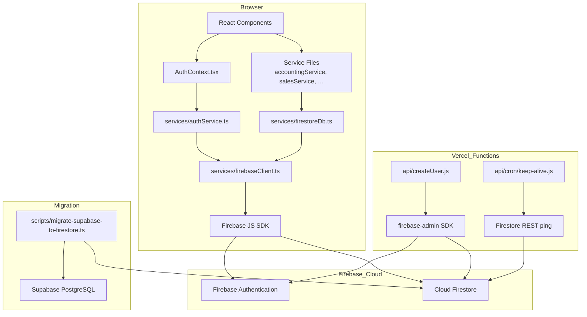

# Design Document — Supabase to Firebase Migration

## Overview

This migration replaces all Supabase dependencies in the Galaltix Commodity ERP with equivalent Firebase services. The application is a React/TypeScript ERP for commodity trading and export operations. It currently uses Supabase PostgreSQL (via PostgREST) for data storage, Supabase Auth for identity management, and a Vercel serverless function backed by the Supabase Admin SDK for privileged user creation.

After migration:
- **Firestore** replaces the Supabase PostgreSQL database.
- **Firebase Authentication** replaces Supabase Auth.
- **Firebase Admin SDK** replaces the Supabase Admin client in the `api/createUser.js` Vercel function.

The primary design constraint is **zero service-file rewrites**: all 20+ service files (`accountingService.ts`, `salesService.ts`, `procurementService.ts`, etc.) call `dbList`, `dbGet`, `dbCreate`, `dbUpdate`, `dbDelete`, and `Query` from an abstraction layer. The new `services/firestoreDb.ts` must expose an identical API surface to the existing `services/supabaseDb.ts`, so the only change across consumer files is the import path.

### Key Design Goals

1. **API surface parity**: `firestoreDb.ts` is a drop-in replacement for `supabaseDb.ts`.
2. **Auth listener model**: Replace polling-based `checkSession()` with Firebase's `onAuthStateChanged` push listener.
3. **Idempotent migration**: A standalone script migrates existing Supabase data to Firestore; re-running it is safe.
4. **No data loss**: All 26 collections, including JSONB/array columns, are faithfully mapped to Firestore documents.

---

## Architecture



**Data flow for a typical service call:**
1. A service file calls `dbList(COLLECTIONS.SUPPLIERS, [Query.equal('is_active', true)])`.
2. `firestoreDb.ts` decodes the JSON-encoded query strings, builds a Firestore `CollectionReference` with `where`, `orderBy`, `limit`, and cursor constraints.
3. Firestore returns `QuerySnapshot` documents.
4. `firestoreDb.ts` normalises each document, adding `$id`, `$createdAt`, `$updatedAt` aliases, and returns `{ data: T[], total: number, error: null }`.

**Authentication flow:**
1. `AuthContext` mounts, calls `onAuthStateChanged(firebaseAuth, handler)`.
2. Firebase SDK fires the handler immediately with the current session state (null or a `User`).
3. Handler calls `authService.getCurrentUser()` which looks up the Firestore `users` profile.
4. `AuthContext` sets `loading = false` after the first event — no polling, no flash of sign-in screen.

---

## Components and Interfaces

### `services/firebaseClient.ts` (new)

Singleton initialisation module. Reads environment variables, initialises the Firebase app (guarded against double-init via `getApps()`), and exports the three shared instances.

```typescript
export const firebaseApp: FirebaseApp;
export const firestoreDb: Firestore;
export const firebaseAuth: Auth;
```

If any of the six required `VITE_FIREBASE_*` variables is an empty string at init time the module logs a descriptive error and throws, preventing silent misconfiguration from reaching Firestore calls.

---

### `services/firestoreDb.ts` (new — replaces `supabaseDb.ts`)

Exports the identical API surface:

```typescript
export const COLLECTIONS: { [key: string]: string };
export const ID: { unique: () => string };
export const Query: {
    equal(attribute: string, value: any): string;
    notEqual(attribute: string, value: any): string;
    greaterThan(attribute: string, value: any): string;
    greaterThanEqual(attribute: string, value: any): string;
    lessThan(attribute: string, value: any): string;
    lessThanEqual(attribute: string, value: any): string;
    search(attribute: string, value: string): string;
    orderAsc(attribute: string): string;
    orderDesc(attribute: string): string;
    limit(value: number): string;
    offset(value: number): string;
};

export async function dbList<T>(collection: string, queries?: string[]): Promise<DbListResponse<T>>;
export async function dbGet<T>(collection: string, recordId: string): Promise<DbResponse<T>>;
export async function dbCreate<T>(collection: string, data: Record<string, any>, recordId?: string): Promise<DbResponse<T>>;
export async function dbUpdate<T>(collection: string, recordId: string, data: Record<string, any>): Promise<DbResponse<T>>;
export async function dbDelete(collection: string, recordId: string): Promise<{ success: boolean; error: string | null }>;
export async function dbCreateBulk<T>(collection: string, rows: Record<string, any>[]): Promise<{ data: T[] | null; error: string | null }>;
```

The `Query` builder continues to encode query intents as JSON strings (same format as `supabaseDb.ts`) so the existing call sites are untouched. `firestoreDb.ts` decodes and translates them to Firestore SDK calls.

**Query decoding → Firestore mapping:**

| Query method     | Firestore SDK call                        |
|------------------|-------------------------------------------|
| `equal` (scalar) | `where(field, '==', value)`               |
| `equal` (array)  | `where(field, 'in', values)`              |
| `notEqual`       | `where(field, '!=', value)`               |
| `greaterThan`    | `where(field, '>', value)`                |
| `greaterThanEqual` | `where(field, '>=', value)`             |
| `lessThan`       | `where(field, '<', value)`                |
| `lessThanEqual`  | `where(field, '<=', value)`               |
| `search`         | `where(field, '>=', value)` + `where(field, '<=', value + '\uf8ff')` (prefix) or client-side `includes` fallback |
| `orderAsc`       | `orderBy(field, 'asc')`                   |
| `orderDesc`      | `orderBy(field, 'desc')`                  |
| `limit`          | `limit(n)`                                |
| `offset`         | cursor-based — see Pagination section     |

**Pagination strategy:** Firestore does not support numeric offsets. `dbList` handles `offset(K)` by first fetching K documents ordered by document ID to obtain the cursor document, then re-running the full query with `startAfter(cursor)`. This is transparent to callers. For large K values this results in a preliminary read of K documents; given the ERP's expected data volume (≤50,000 documents per collection) this is acceptable.

**Document normalisation:** Every document returned by `dbGet`, `dbList`, and `dbCreate` is passed through a `normalizeDoc` helper:

```typescript
function normalizeDoc(id: string, data: DocumentData): any {
    return {
        ...data,
        id,
        $id: id,
        $createdAt: data.created_at instanceof Timestamp
            ? data.created_at.toDate().toISOString()
            : data.created_at ?? null,
        $updatedAt: data.updated_at instanceof Timestamp
            ? data.updated_at.toDate().toISOString()
            : data.updated_at ?? null,
    };
}
```

---

### `services/authService.ts` (rewrite)

Replaces Supabase Auth calls with Firebase Auth SDK. The exported `authService` object keeps the same shape so no call sites change.

```typescript
export interface AuthUser { id: string; email: string; name: string; role: UserRole; locationId?: string; }

export const authService = {
    signIn(email: string, password: string): Promise<AuthUser>,
    signUp(email: string, password: string, name: string, role?: UserRole): Promise<AuthUser>,
    signOut(): Promise<void>,
    getCurrentUser(): Promise<AuthUser | null>,
    updateUserProfile(userId: string, updates: Partial<User>): Promise<boolean>,
    // resetUserPassword removed — password reset via Firebase console/email flow
};
```

`signIn` → `signInWithEmailAndPassword(firebaseAuth, email, password)`.
`signOut` → `signOut(firebaseAuth)`.
`getCurrentUser` → reads `getAuth().currentUser`, looks up Firestore `users` profile by UID, auto-creates profile for first-time users.
`signUp` → `createUserWithEmailAndPassword`, then `dbCreate` on the `users` collection.

---

### `context/AuthContext.tsx` (rewrite)

Replaces polling with a Firebase listener:

```typescript
useEffect(() => {
    const unsubscribe = onAuthStateChanged(firebaseAuth, async (firebaseUser) => {
        if (firebaseUser) {
            const profile = await authService.getCurrentUser();
            setUser(profile);
        } else {
            setUser(null);
        }
        setLoading(false);   // only false after first event
    });
    return unsubscribe;     // cleanup on unmount
}, []);
```

The `loading` flag is set to `false` only inside the `onAuthStateChanged` callback — this prevents the sign-in screen flash on valid sessions because Firebase delivers the persisted session synchronously before the first render cycle completes on cold load.

---

### `api/createUser.js` (rewrite)

Replaces Supabase Admin client with Firebase Admin SDK. The HTTP contract (request/response shape, CORS headers, role checks) is unchanged.

```javascript
// Initialisation (lazy singleton via getApps())
const app = !getApps().length
    ? initializeApp({ credential: cert({ projectId, clientEmail, privateKey }) })
    : getApp();
const adminAuth = getAuth(app);
const adminDb = getFirestore(app);

// Token verification
const decoded = await adminAuth.verifyIdToken(token);  // replaces supabaseAdmin.auth.getUser

// User creation
await adminAuth.createUser({ email, password, emailVerified: true, displayName: name });
await adminDb.collection('users').doc(uid).set({ email, name, role, location, is_active: true }, { merge: true });
```

---

### `api/cron/keep-alive.js` (update)

Currently instantiates a Supabase client and queries `users`. After migration it performs a lightweight Firestore document read using the Firebase Admin SDK (same credentials as `createUser.js`), removing the Supabase dependency:

```javascript
await adminDb.collection('users').limit(1).get();
```

The Vercel cron schedule in `vercel.json` is unchanged.

---

### `utils/cacheManager.ts` (update)

The `essentialKeys` array is updated:

```typescript
// REMOVE (Supabase):
'sb-hzigzdwxwtykjqypkiln-auth-token'
'galaltix-auth-token'

// ADD (Firebase — pattern-based):
```

Because Firebase Auth stores keys with the dynamic format `firebase:authUser:<API_KEY>:[DEFAULT]`, a static string cannot cover all possible project API keys. The `clearLocalStorage` method is updated to use pattern matching:

```typescript
private isEssentialKey(key: string): boolean {
    if (this.essentialKeys.includes(key)) return true;
    if (key.startsWith('firebase:authUser:')) return true;
    if (key.startsWith('firebase:')) return true;  // covers refresh tokens
    return false;
}
```

---

### `scripts/migrate-supabase-to-firestore.ts` (new)

A standalone Node.js script (run once, outside of the Vite build):

1. Reads Supabase credentials from env vars (`SUPABASE_URL`, `SUPABASE_SERVICE_ROLE_KEY`).
2. Reads Firebase credentials from env vars (`FIREBASE_PROJECT_ID`, `FIREBASE_CLIENT_EMAIL`, `FIREBASE_PRIVATE_KEY`).
3. Iterates over all 26 collections defined in `COLLECTIONS`.
4. For each collection, fetches all rows from Supabase in batches of 1,000.
5. For each row, maps column values: UUID → document ID, `TIMESTAMPTZ` → Firestore `Timestamp`, JSONB → nested map, `TEXT[]` → Firestore array.
6. Writes to Firestore using `batch.set(docRef, data)` with `{ merge: true }` (upsert semantics).
7. Logs per-collection counts and any document-level failures without aborting.

---

### `firestore.rules` (new)

```
rules_version = '2';
service cloud.firestore {
  match /databases/{database}/documents {
    match /{document=**} {
      // TODO(production): restrict reads/writes by company_id and user role
      allow read, write: if request.auth != null;
    }
  }
}
```

---

## Data Models

### Firestore Collection Mapping

Each Supabase table maps to a Firestore top-level collection with the same name as the `COLLECTIONS` constant value.

| Collection | Notable Firestore mapping notes |
|---|---|
| `suppliers` | `address` (JSONB) → nested map; `bank_details` (JSONB) → nested map |
| `buyers` | same as suppliers |
| `commodity_batches` | `quality_parameters` (JSONB) → nested map; `packaging_info` (JSONB) → nested map |
| `shipments` | `container_numbers TEXT[]` → Firestore array field |
| `purchase_contracts` | FK `supplier_id` stored as plain string |
| `sales_contracts` | FK `buyer_id` stored as plain string |
| `journal_entry_lines` | parent FK `journal_entry_id` stored as plain string |
| `audit_logs` | `changes` (JSONB) → nested map |
| `compliance_records` | `documents` (JSONB array) → Firestore array of maps |
| `users` | `id` column from Supabase maps to Firebase Auth UID for new users; migration preserves existing UUIDs as document IDs |

### Document Shape

Every document stored by `firestoreDb.ts` includes:

```typescript
{
    id: string;             // same as Firestore document ID
    created_at: Timestamp;  // Firestore Timestamp
    updated_at: Timestamp;  // Firestore Timestamp (set on create, updated on update)
    // ... all other domain fields
}
```

On retrieval, `normalizeDoc` overlays:

```typescript
{
    $id: string;        // alias for id
    $createdAt: string; // ISO 8601 string
    $updatedAt: string; // ISO 8601 string
}
```

### Composite Index Requirements

The following Firestore composite indexes are required (to be defined in `firestore.indexes.json`):

| Collection | Fields | Query source |
|---|---|---|
| `commodity_batches` | `supplier_id ASC`, `created_at DESC` | procurement/inventory filters |
| `purchase_contracts` | `supplier_id ASC`, `status ASC` | contract list filters |
| `sales_contracts` | `buyer_id ASC`, `status ASC` | contract list filters |
| `shipments` | `contract_id ASC`, `created_at DESC` | shipment tracking |
| `audit_logs` | `entity_type ASC`, `created_at DESC` | audit trail viewer |
| `journal_entry_lines` | `journal_entry_id ASC`, `created_at ASC` | accounting entries |
| `invoices` | `status ASC`, `created_at DESC` | invoice manager |

These indexes must be deployed via `firebase deploy --only firestore:indexes` before the application goes live.

### Sequence Generation (batch numbers, contract numbers)

The SQL schema uses stored procedures (e.g., `generate_batch_number`) for sequence-based IDs. After migration these are implemented in TypeScript:

- **Batch numbers**: `BATCH-{YYYYMMDD}-{random 4-digit suffix}` generated in `commodityMasterService.ts`.
- **Contract numbers**: `PC-{YYYY}-{sequential counter}` — the counter is stored as a Firestore document in a `_sequences` collection, updated via `runTransaction` to guarantee uniqueness.

---

## Correctness Properties

*A property is a characteristic or behavior that should hold true across all valid executions of a system — essentially, a formal statement about what the system should do. Properties serve as the bridge between human-readable specifications and machine-verifiable correctness guarantees.*

### Property 1: Query constraint fidelity

*For any* combination of `Query` filter, order, and limit objects passed to `dbList`, the resulting Firestore `CollectionReference` constraints must be semantically equivalent to the intended filter — specifically, a document that satisfies all filter predicates must appear in the results, and a document that fails any predicate must not.

**Validates: Requirements 2.2, 3.1**

---

### Property 2: Create-then-get round-trip

*For any* collection name and any document data object, creating a document with `dbCreate` and immediately retrieving it with `dbGet` using the same ID must return an object that is deep-equal to the original data (plus the normalised aliases `$id`, `$createdAt`, `$updatedAt`).

**Validates: Requirements 2.3, 2.4, 13.2**

---

### Property 3: Partial update preserves unmodified fields

*For any* document with N fields, calling `dbUpdate` with a subset of M fields (M < N) must leave the remaining N−M fields unchanged. The updated fields must reflect the new values.

**Validates: Requirements 2.5**

---

### Property 4: Document normalisation invariant

*For any* document retrieved from Firestore via `dbGet` or `dbList`, the returned object must satisfy: `result.$id === result.id` AND `result.$createdAt` is a valid ISO 8601 date string AND `result.$updatedAt` is a valid ISO 8601 date string.

**Validates: Requirements 2.7, 8.4, 13.2**

---

### Property 5: Firebase Auth cache key preservation

*For any* set of `localStorage` keys that includes keys matching the pattern `firebase:authUser:*`, calling `cacheManager.clearLocalStorage()` must preserve all Firebase Auth keys and remove all non-essential, non-Firebase keys.

**Validates: Requirements 7.1, 7.3, 13.4**

---

### Property 6: Pagination correctness

*For any* collection with N documents and any offset K and limit M (where K + M ≤ N), calling `dbList` with `Query.offset(K)` and `Query.limit(M)` must return exactly M documents representing the correct slice of the ordered result set, with no overlap with the slice returned by `Query.offset(0)` and `Query.limit(K)`.

**Validates: Requirements 3.4**

---

### Property 7: Migration mapping correctness

*For any* Supabase row object, the migration mapping function must produce a Firestore document where: (a) the UUID primary key `id` becomes the document ID, (b) every `TIMESTAMPTZ` field is converted to a Firestore `Timestamp` object, (c) JSONB fields are converted to nested maps, and (d) `NULL` foreign key references are written as `null` (not omitted).

**Validates: Requirements 9.2, 9.3**

---

### Property 8: Migration idempotency

*For any* set of rows, running the migration script twice must produce the same Firestore collection state as running it once — no duplicated documents and no data corruption on the second run.

**Validates: Requirements 9.5**

---

## Error Handling

### Firestore operation failures

`firestoreDb.ts` wraps every Firestore call in a `try/catch`. On failure it:
1. Logs `[firestoreDb] ${operation} ${collection}: ${error.message}` to `console.error`.
2. Returns the standardised error envelope (`{ data: null, error: string }` or `{ data: [], total: 0, error: string }`).
3. Never throws — preserves the same non-throwing contract as `supabaseDb.ts`.

### Firebase Auth errors

`authService.ts` surfaces Firebase Auth error messages directly as `Error` objects, matching the existing Supabase behaviour. UI components (`SignIn.tsx`) already handle `error.message` display.

### `api/createUser.js` partial failure

If Firebase Auth user creation succeeds but the Firestore profile write fails, the function logs the inconsistency and returns HTTP 500 with a message describing the partial state. The Auth user is not automatically deleted to avoid data loss — an admin can re-trigger the profile write or clean up manually.

### Missing environment variables

`firebaseClient.ts` validates all six `VITE_FIREBASE_*` variables at module load time. Any missing variable causes an early throw with a message listing the missing key names. This surfaces during `npm run build` and on first page load in development, preventing cryptic Firestore "permission denied" errors.

### `api/cron/keep-alive.js` failure

The keep-alive job is best-effort. A Firestore read failure is logged and returns HTTP 500, but does not affect application availability. Vercel will retry on the next scheduled interval.

### Migration script errors

Individual document write failures are caught, logged with the collection name and document ID, and skipped. The script exits with a non-zero code only if an entire collection fails to initialise (e.g., Firestore credentials are invalid).

---

## Testing Strategy

### Unit Tests

Unit tests cover specific examples, edge cases, and error conditions using mocked Firebase SDK calls.

**`firestoreDb.ts` unit tests:**
- `dbCreate` with explicit `recordId` uses that ID as the Firestore document ID.
- `dbCreate` without `recordId` generates a UUID.
- `dbGet` with a non-existent ID returns `{ data: null, error: null }`.
- `dbDelete` returns `{ success: true, error: null }` on success.
- `dbList` with `Query.equal(field, [v1, v2])` applies a Firestore `in` constraint.
- Firestore throwing an error causes `dbList` to return `{ data: [], total: 0, error: '...' }`.

**`authService.ts` unit tests:**
- `signIn` with valid credentials returns an `AuthUser` with correct shape.
- `signIn` with invalid credentials throws an `Error` with the Firebase message.
- `signOut` calls Firebase `signOut`.
- `getCurrentUser` when no Firestore profile exists auto-creates a profile with role `OPERATOR`.

**`AuthContext.tsx` unit tests:**
- `loading` is `true` before `onAuthStateChanged` fires and `false` after.
- When Firebase state is `null`, `user` is set to `null`.
- On unmount, the `onAuthStateChanged` unsubscribe function is called.

**`cacheManager.ts` unit tests:**
- `clearLocalStorage` preserves keys matching `firebase:authUser:*`.
- `clearLocalStorage` removes non-essential keys.

### Property-Based Tests

Property-based tests use a library appropriate for TypeScript (e.g., **fast-check**), configured for a minimum of 100 iterations per property.

Each test is tagged with a comment in the format:
`// Feature: supabase-to-firebase-migration, Property {N}: {property_text}`

**Property 1 — Query constraint fidelity** (`firestoreDb.ts`)
- Generator: random `(field, operator, value)` triples mapped to `Query.*` calls.
- Mock Firestore SDK, capture the `where`/`orderBy` constraints built.
- Assert: every filter Query is translated to the matching Firestore constraint.

**Property 2 — Create-then-get round-trip** (`firestoreDb.ts`)
- Generator: random document data objects (string/number/boolean fields, random collection name from `COLLECTIONS`).
- Call `dbCreate`, then `dbGet` with the returned ID.
- Assert: all original fields present, `$id` === `id`, `$createdAt` and `$updatedAt` are ISO 8601.

**Property 3 — Partial update preserves unmodified fields** (`firestoreDb.ts`)
- Generator: random document with ≥3 fields; random non-overlapping subset as update payload.
- Assert: fields not in the update payload are unchanged; updated fields reflect new values.

**Property 4 — Document normalisation invariant** (`firestoreDb.ts`)
- Generator: random Firestore `DocumentSnapshot` with `created_at` and `updated_at` as `Timestamp` objects.
- Assert: `$id` === document ID, `$createdAt` parses as a valid `Date`, `$updatedAt` parses as a valid `Date`.

**Property 5 — Firebase Auth cache key preservation** (`cacheManager.ts`)
- Generator: random sets of `localStorage` key names — some matching `firebase:authUser:*`, some not.
- Populate mock `localStorage`, call `clearLocalStorage`.
- Assert: all `firebase:authUser:*` keys survive; all non-essential, non-Firebase keys are removed.

**Property 6 — Pagination correctness** (`firestoreDb.ts`)
- Generator: random N (10–100 documents), random K offset (0 to N/2), random M limit (1 to N/2).
- Seed Firestore mock with N documents. Query with offset K, limit M.
- Assert: result length === M, no document ID overlap with the first K documents.

**Property 7 — Migration mapping correctness** (`scripts/migrate-supabase-to-firestore.ts`)
- Generator: random Supabase row objects with UUID `id`, `TIMESTAMPTZ` `created_at`/`updated_at`, nullable FK fields, and JSONB columns.
- Apply the migration mapping function (pure function extracted from the script).
- Assert: document ID === original `id`; `created_at` is a Firestore `Timestamp`; JSONB fields are plain objects; NULL FKs are written as `null`.

**Property 8 — Migration idempotency** (`scripts/migrate-supabase-to-firestore.ts`)
- Generator: random array of row objects for a collection.
- Run the mapping + upsert logic twice on a mock Firestore.
- Assert: collection document count after second run === count after first run; document data identical.

### Integration Tests

Integration tests verify wiring between components using a Firebase Emulator Suite (local emulator, no cloud calls).

- Full auth flow: sign-in → `onAuthStateChanged` fires → `AuthContext` user state set.
- `api/createUser.js`: POST with valid admin token creates a Firebase Auth user and Firestore profile document.
- `api/cron/keep-alive.js`: GET returns 200 with `success: true` when Firestore is reachable.
- CRUD round-trip for one representative collection (e.g., `suppliers`) through the full stack.

### Build Verification

`npm run build` (Vite + TypeScript) must pass with zero errors after migration. This is the primary smoke test for API surface parity between `firestoreDb.ts` and `supabaseDb.ts`, since all service files import and call the abstraction layer functions under TypeScript's type checker.
